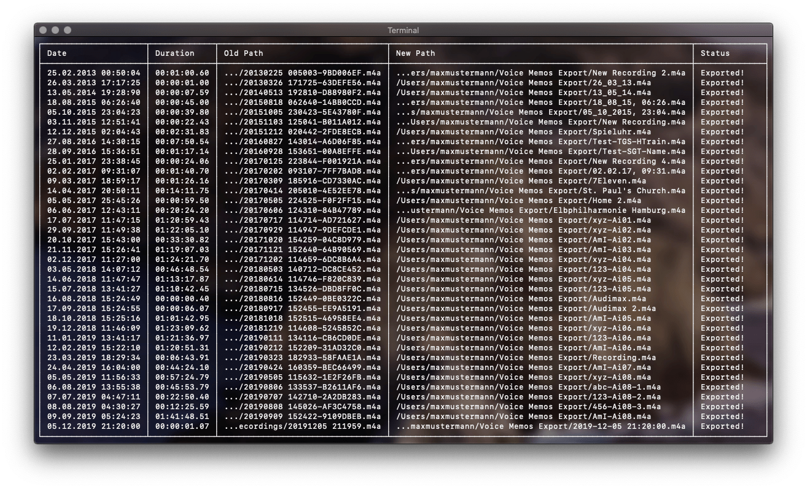

# macOS Voice Memos Exporter
Python project to export audio files from macOS Voice Memos app with right filename and date created

Since Apple has forgotten to implement a serious export function to the Voice Memos app, this project will help you.
You can export all or selected memos as audio files. The names of the files correspond to the labels of the memos.
The recording date of the memos can be found in the creation date of the files and can be also added to the file name.

## Parameters
#### Database File Path
Use `-d` or `--db_path` to specify the path to the database Voice Memo App uses to store information about the memos.

Default: `~/Library/Application Support/com.apple.voicememos/Recordings/CloudRecordings.db`

If you don't use iCloud Sync for Voice Memos, this path could be also interesting for you:
`~/Library/Application Support/com.apple.voicememos/Recordings/Recordings.db` (not proved)

#### Export Folder Path
Use `-e` or `--export_path` to change the export folder path.

Defaut: `~/Voice Memos Export`

#### Export All Memos
Add the flag `-a` or `--all` to export all memos at once instead instead of deciding for each memo whether it should be exported or not.

#### Add Date to File Name
Add the flag `--date_in_name` to add the recording date at the beginning of the file name.

#### Date Format for File Name
If you use the flag `--date_in_name` you can modify the date format with `--date_in_name_format`.

Default: `%Y-%m-%d-%H-%M-%S_` ➔ 2019-12-06-22-31-11_

#### Prevent to Open Finder
Use the flag `--no_finder` to avoid opening a finder window to view exported memos.

### Example
`python main.py -e ~/Music/memos -a --date_in_name --date_in_name_format "%Y-%m-%d "`

## Disclaimer:
No liability for damage to the memo database, library folder, or anywhere else in the file system.
Create a backup (in particular of `~/Library`) before using this tool.
